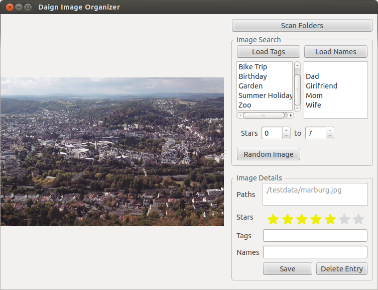

# daign-image-organizer

### Idea

I keep my photos organized in folders and normally that suits all my needs. However there is one problem with this: once the images are buried deep inside the folder structure I almost never look at them again.

* So the main idea for this project was to make a program that randomly presents images from all subfolders of a photo archive.
* But since I normally would like to see only the best photos, there has to be some rating system. That is where the organizing part comes in.
* Thirdly the system should not interfere with my handling of the image files.

### Functions

* Scans for all the images in a directory and its subdirectories.
* Randomly presents one images at a time or all.
* Images can be scored and tagged with categories and names.
* The scores and tags can be used to filter the presented images.
* Scores and tagging information is stored inside a database alongside the script.
* Scores and tags are only linked to the hash of the image content, so renaming and moving the images around does not unlink the scores and tags.
* The gui shows the folder path of the image and all its identical copies. (As long as the copies have the same hash. Linking images based on similarity invariant to cropping, rotation and color adjustments would be a cool feature for future development.)
* Several independent instances of the programm can be used for different folders on one system.

### Usage

Package the files in the src folder to a zip archive. Copy and run the zip file from the top folder of your photo archive with python.

### Known Limitations

* Image files are only recognised by file ending.
* Gifs will not be displayed with animation.
* No zooming in or out.
* Once image files are deleted from the file system and a new folder scan has been run, scores and tag information for the deleted images remain in the database. Since they are not shown anymore, there is currently no way to delete this entries.
* It is not possible to select more than one tag for filtering. Though tag and name filters can be applied at once.
* Images take up the maximum space inside the view area. Window cannot be sized down afterwards.

